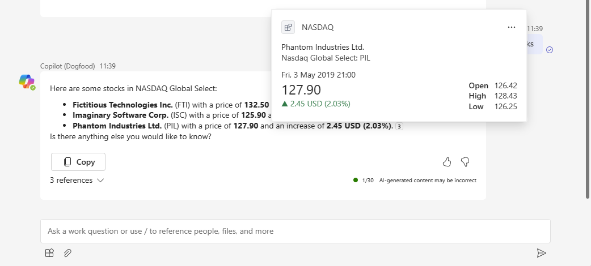

# Using multiple parameters in a plugin for Microsoft Copilot for Microsoft 365 using .NET and Teams Toolkit for Visual Studio sample




## Prerequisites

- [Visual Studio 2022 17.7+](https://visualstudio.microsoft.com)
- [Teams Toolkit](https://learn.microsoft.com/microsoftteams/platform/toolkit/toolkit-v4/install-teams-toolkit-vs?pivots=visual-studio-v17-7)
- You will need a Microsoft work or school account with [permissions to upload custom Teams applications](https://learn.microsoft.com/microsoftteams/platform/concepts/build-and-test/prepare-your-o365-tenant#enable-custom-teams-apps-and-turn-on-custom-app-uploading). The account will also need a Microsoft Copilot for Microsoft 365 license to use the extension in Copilot.

## Minimal path to awesome

- Clone repo
- Open solution in Visual Studio
- Create [environment files](#environment-files)
- [Create a public dev tunnel](https://learn.microsoft.com/microsoftteams/platform/toolkit/toolkit-v4/debug-local-vs?pivots=visual-studio-v17-7#set-up-dev-tunnel-only-for-bot-and-message-extension)
- Run [Prepare Teams apps dependencies](https://learn.microsoft.com/microsoftteams/platform/toolkit/toolkit-v4/debug-local-vs?pivots=visual-studio-v17-7#set-up-your-teams-toolkit)
- Press <kbd>F5</kbd> and follow the prompts

### Environment files

#### env\\.env.local

```
TEAMSFX_ENV=local
```

#### env\\.env.local.user

```
SECRET_BOT_PASSWORD=
```

#### env\\.env.dev

```
TEAMSFX_ENV=dev
```

#### env\\.env.dev.user

```
SECRET_BOT_PASSWORD=
```

## Test in Copilot

- Enable the plugin
- Use a basic prompt: `Find stocks in NASDAQ Stocks`
- Use an advanced prompt: `Find top 10 stocks in NASDAQ Stocks with P/B < 2 and P/E < 30`

